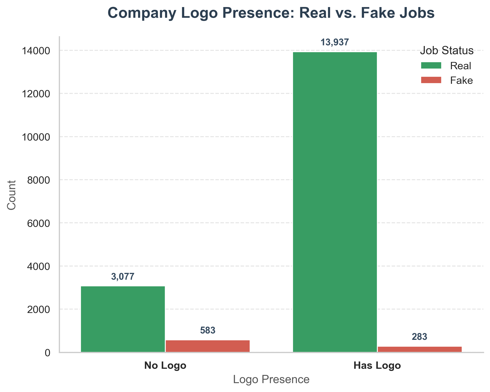
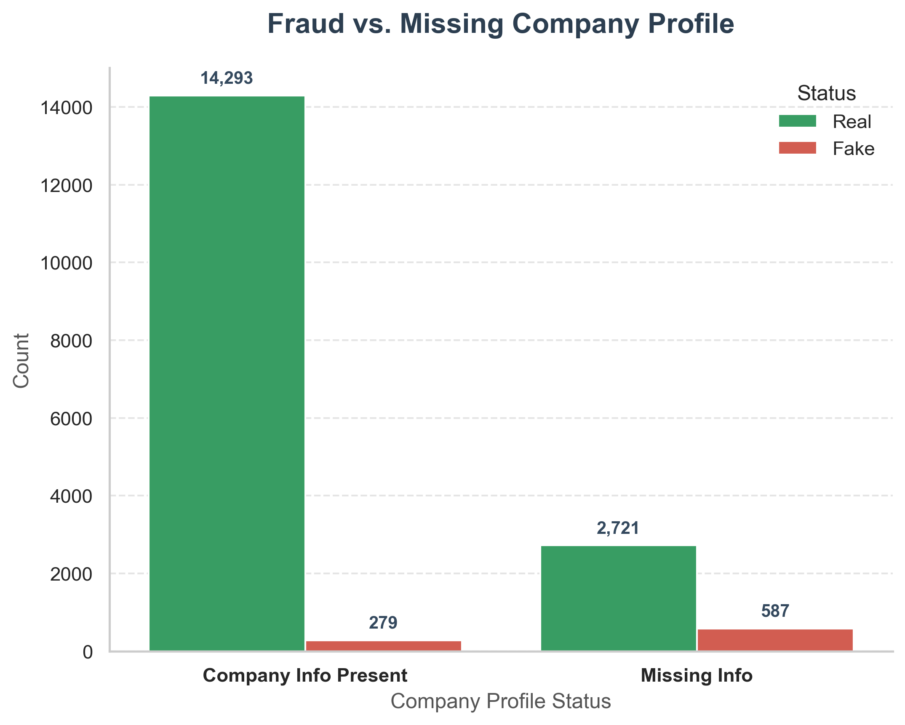
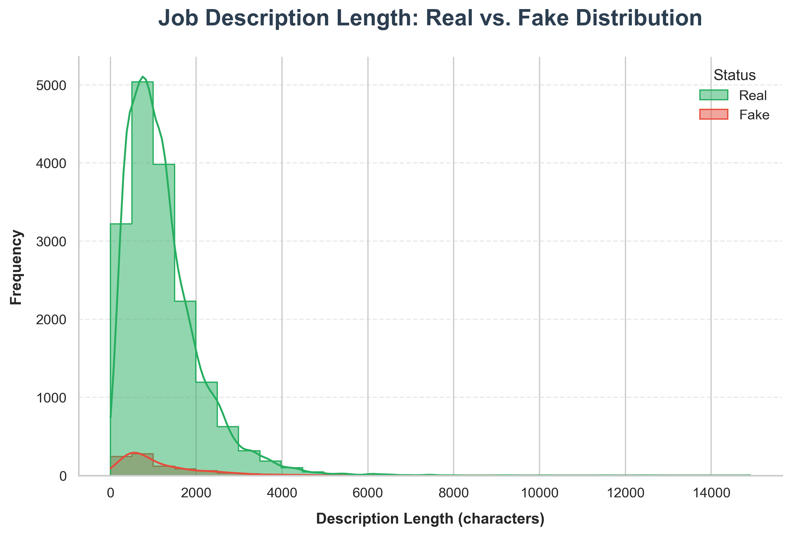
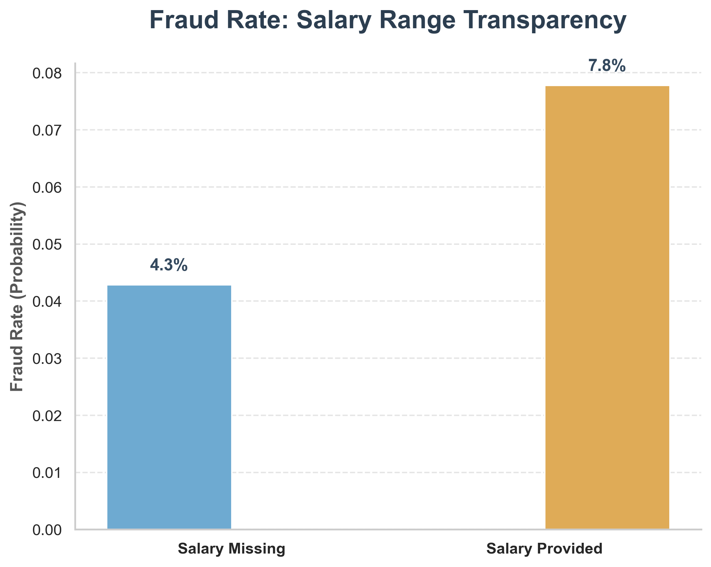
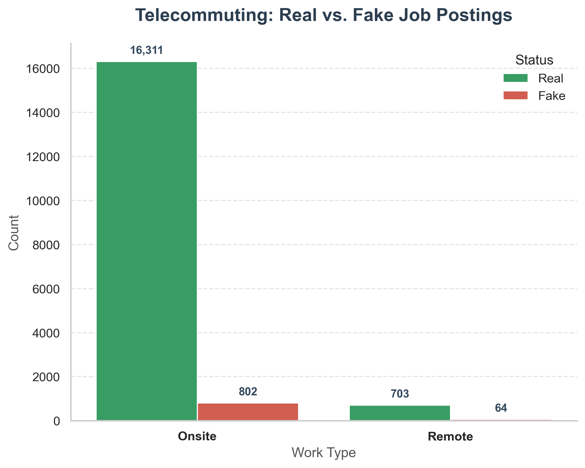
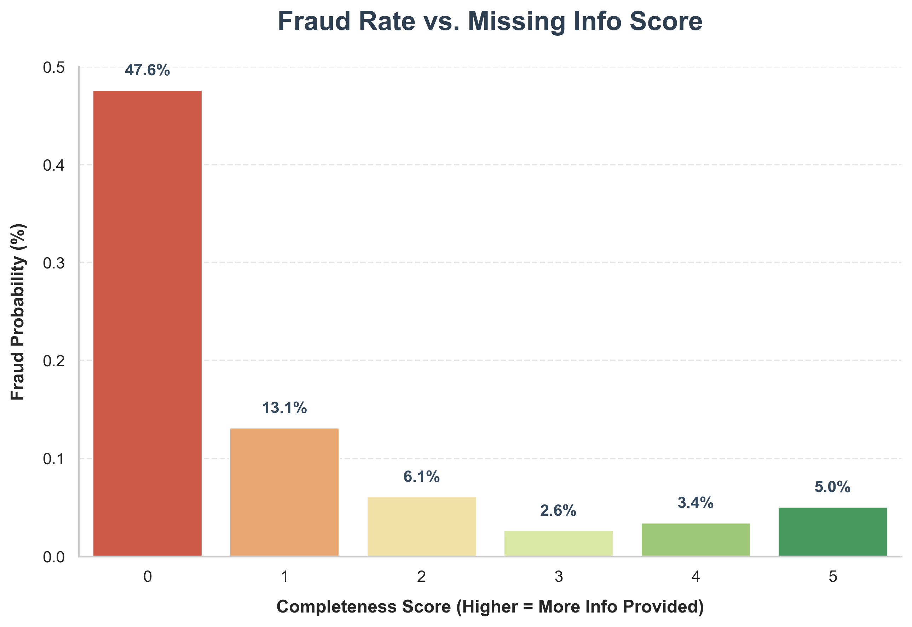
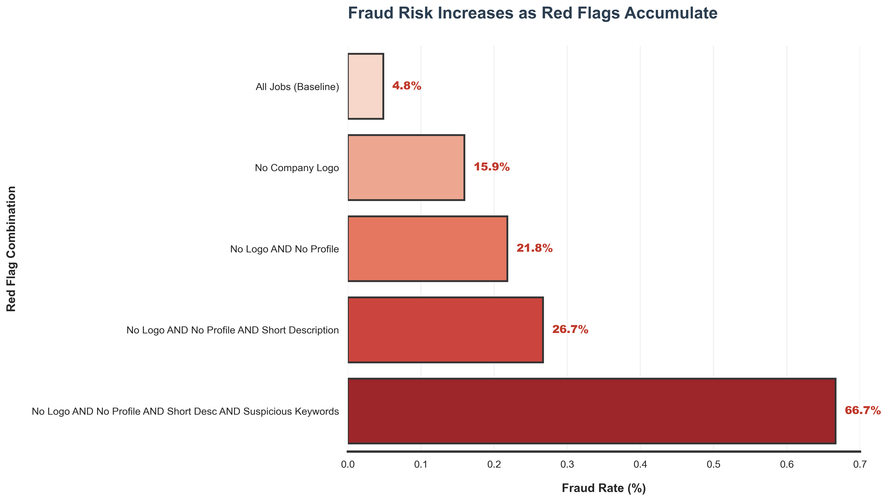
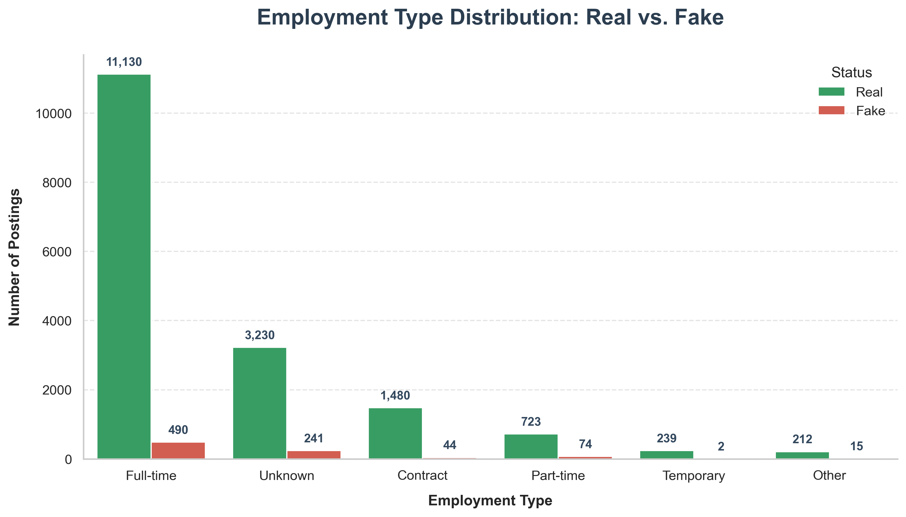

<div align="center">

# Real vs. Fake Job Posting Analysis

**Python | Pandas | Matplotlib | Seaborn**

Analyzed 17,880 job listings to find what separates fake posts from real ones — and built a simple Trust Score system to flag suspicious listings before they reach job seekers.


[](https://colab.research.google.com/github/analytics-ak/fake-job-detection/blob/main/scam_job_detection_and_risk_analysis.ipynb)
[](https://mybinder.org/v2/gh/analytics-ak/fake-job-detection/main?labpath=scam_job_detection_and_risk_analysis.ipynb)

</div>

---

## Problem Statement

Job platforms face a growing problem with fake listings. These posts look similar to real jobs, waste people's time, and can lead to financial scams. Manual detection doesn't scale.

The question this project answers: **What are the simplest, most reliable signals that separate fake job posts from real ones — and can we turn them into a scoring system?**

---

## What This Project Does

- Analyzes **17,880 job postings** (real and fake) to find fraud patterns
- Compares fake vs real listings across company info, description quality, keywords, and salary
- Tests which signals actually matter and which ones don't
- Builds a **Trust Score system** that flags suspicious posts based on combined red flags
- Ends with clear, actionable recommendations for job platforms

This approach does not rely on machine learning — it uses simple, rule-based pattern detection that any platform can implement immediately without building or training a model.

---

## The Dataset

| Detail | Info |
|--------|------|
| **Source** | [Kaggle — Real or Fake Job Posting Prediction](https://www.kaggle.com/shivamb/real-or-fake-fake-jobposting-prediction) |
| **Total Rows** | 17,880 |
| **Columns** | 18 |
| **Fake Posts** | ~4.8% (866 out of 17,880) |
| **Type** | Mix of text fields and numeric flags |

### Key Columns

| Column | What It Tells Us |
|--------|-----------------|
| title | Job title |
| location | Where the job is based |
| company_profile | A short description of the company |
| description | The full job description |
| requirements | What skills or experience the job asks for |
| has_company_logo | 1 = logo is there, 0 = missing |
| has_company_profile | 1 = company profile filled in, 0 = blank |
| telecommuting | 1 = remote work allowed, 0 = office only |
| salary_range | Pay details (when the company shared them) |
| employment_type | Full-time, Part-time, Contract, etc. |
| fraudulent | **1 = fake post, 0 = real post** |

Several columns like `salary_range` and `department` have high missing rates — which itself turns out to be one of the strongest fraud signals.

---

## Key Findings

### 1. Missing Company Info is the Strongest Fraud Signal

Fake posts almost never include a company logo or profile. Real companies show who they are. Scammers hide.





---

### 2. Fake Descriptions are Short and Vague

Real job posts average much longer descriptions. Scammers don't bother writing detailed role descriptions — they keep it short, generic, and vague.



---

### 3. Suspicious Keywords Show Up More in Fake Posts

Words like "easy money," "fast cash," "urgent," and "work from home" appear in about **12% of fake posts** compared to just **~4% of real ones.**

Real company profiles average **~96 words**. Fake ones average **~32 words**. Short profiles combined with bait language = higher fraud risk.

---

### 4. Salary Info Can Be Misleading

This one is counterintuitive. Posts that include salary details actually have a **slightly higher fraud rate**. Some scammers add fake salary ranges to make the listing look more convincing.

Salary presence alone is not a reliable safety signal.



---

### 5. Remote Jobs Carry Slightly Higher Risk

Fake listings lean more toward remote claims. Scammers use "remote" as bait because it widens the target audience. Not a strong signal on its own, but worth noting.



---

### 6. Missing Info Score — The Most Important Finding

A single score based on how many fields a post leaves blank. The fraud rate drops sharply as the score goes up.

One missing field is normal. Four missing fields is a red flag.



---

### 7. Red Flags Stack Up — From 5% to 67%

This is where it all comes together. Individual signals are useful, but when they combine, the fraud rate climbs steeply.

| Red Flag Combination | Fraud Rate |
|---------------------|-----------|
| All Jobs (Baseline) | 4.8% |
| No Company Logo | 15.9% |
| No Logo AND No Profile | 21.8% |
| + Short Description | 26.7% |
| + Suspicious Keywords | **66.7%** |



A post that hits all four red flags has a **67% chance of being fake** — up from a 5% baseline. That's the foundation of the Trust Score.

---

## What Didn't Matter

| Factor | Result |
|--------|--------|
| Employment Type | Fake posts spread across all types — not a useful filter |



---

## Trust Score System

Based on the patterns above, a simple scoring system can flag risky job listings before they go live.

Each new post gets checked on five signals:

| Signal | Red Flag Condition | Points |
|--------|-------------------|--------|
| Company logo | Missing | +1 |
| Company profile | Missing or blank | +1 |
| Description length | Below a set character threshold | +1 |
| Suspicious keywords | Contains 2+ flagged words | +1 |
| Missing info score | 3+ fields left blank | +1 |

**How to read the score:**

- **0–1** → Low risk. Post goes live immediately.
- **2–3** → Medium risk. Flag for quick review.
- **4–5** → High risk. Hold for manual review before publishing.

This kind of check takes milliseconds to run. It catches most fake posts without creating friction for real employers who fill in their details properly.

---

## Recommendations

Three things a job platform should do based on this data:

**1. Require company identity fields**
Make company name, logo upload, and profile description mandatory. This single change blocks the most common pattern in fake posts.

**2. Set minimum content standards**
Add a minimum character count for job descriptions and requirements. A floor of 200–300 characters would filter out the laziest scams.

**3. Flag suspicious keyword combinations**
Build a simple keyword scanner. One keyword alone isn't enough — but two or three together should trigger a review.

---

## Conclusion

The data shows a consistent pattern: fake job postings lack basic transparency, structure, and detail that real employers naturally provide.

These patterns are consistent enough to catch most fakes with a simple scoring system — no machine learning required. The Trust Score approach is lightweight, easy to implement, and doesn't slow down legitimate employers.

For any platform dealing with job posting fraud, this analysis provides a ready-to-use framework: check the signals, calculate a score, flag the risky ones.

---

## Data Quality

Before any analysis, the data was checked:

- Missing values identified and handled across all 18 columns
- Text fields filled with "Unknown" where blank
- Binary flags created for missing company info, salary, location, education, and industry
- All features validated before being used in scoring

---

## Tools & Libraries

| Tool | Used For |
|------|----------|
| Python | Data cleaning, feature engineering, analysis |
| Pandas | Data manipulation and grouping |
| NumPy | Numerical operations |
| Matplotlib | All charts and visualizations |
| Seaborn | Statistical plots and styled visuals |
| Jupyter Notebook | Full end-to-end analysis |

---

## Project Structure

```
fake-job-detection/
│
├── scam_job_detection_and_risk_analysis.ipynb    # Full analysis notebook
├── fake_job_postings.csv                          # Dataset
├── README.md                                      # This file
│
└── images/                                        # All charts generated by the notebook
    ├── missing_data_chart_high_res.png
    ├── real_vs_fake_jobs_high_res.png
    ├── top_missing_columns_high_res.png
    ├── company_logo_comparison_high_res.png
    ├── telecommuting_comparison_high_res.png
    ├── employment_type_distribution_high_res.png
    ├── missing_company_profile_fraud_high_res.png
    ├── description_length_fixed_legend.png
    ├── salary_transparency_fraud_rate.png
    ├── completeness_vs_fraud_rate.png
    └── risk_factor_bold_high_res.png
```

---

## How to Run This Project

1. Clone this repo
   ```bash
   git clone https://github.com/analytics-ak/fake-job-detection.git
   ```
2. Install the required libraries
   ```bash
   pip install pandas numpy matplotlib seaborn
   ```
3. Open the notebook
   ```bash
   jupyter notebook scam_job_detection_and_risk_analysis.ipynb
   ```
4. Run all cells — charts will generate automatically

---

## Profile & Dataset

* 🔗 **LinkedIn:** [View My Profile](https://www.linkedin.com/in/analytics-ashish/)
* 📂 **Dataset:** [Real or Fake Job Posting on Kaggle](https://www.kaggle.com/shivamb/real-or-fake-fake-jobposting-prediction)
* 💻 **GitHub Repository:** [Fake Job Detection](https://github.com/analytics-ak/real-vs-fake-job-postings)
* 📘 **Notebook:** [scam_job_detection_and_risk_analysis.ipynb](https://github.com/analytics-ak/real-vs-fake-job-postings/blob/main/scam_job_detection_and_risk_analysis.ipynb)

<br>

## Author

**Ashish Kumar Dongre**
Data Analyst

- Python | Pandas | Data Analysis
- Focus: **Business-driven data insights**
